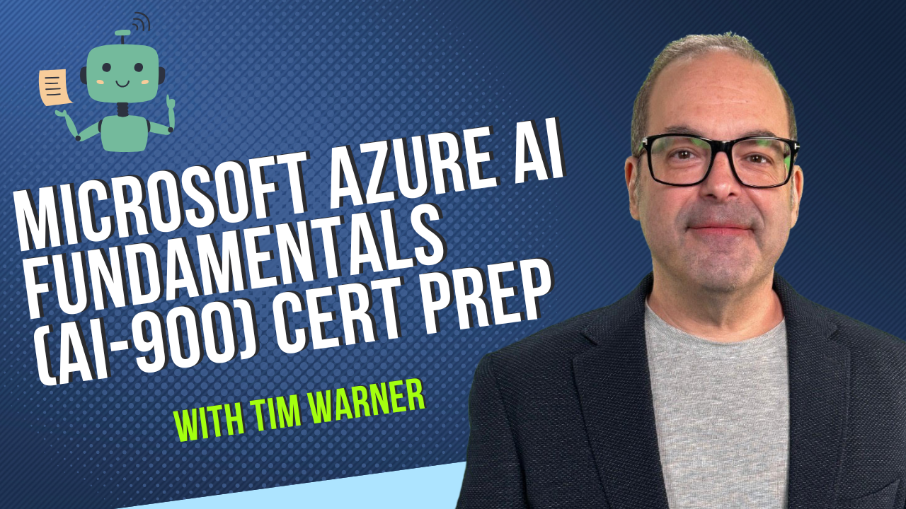

# 🤖 ✨ Microsoft Azure AI Fundamentals (AI-900) Certification Prep (2nd Edition)

  

Short link: [go.techtrainertim.com/ai900](https://github.com/timothywarner/ai900/)

Welcome to the official preparation course for the Microsoft Azure AI Fundamentals (AI-900) certification exam. This training program is designed to help you master Azure AI services and achieve certification. 🎯

## 📝 Exam Information

- **Name**: Microsoft Azure AI Fundamentals
- **Exam Code**: AI-900
- **Last Updated**: May 2, 2025
- **Official Page**: [Microsoft Learn AI-900](https://learn.microsoft.com/credentials/certifications/azure-ai-fundamentals/)

## 🎓 Course Overview

This course provides hands-on experience and in-depth knowledge of Microsoft Azure AI services, including Azure OpenAI Service, Cognitive Services, Machine Learning, and responsible AI practices.

## 🎯 Certification Exam Domains

| Domain                                                    | Weight     |
|------------------------------------------------------------|------------|
| Describe Artificial Intelligence workloads and considerations | 15-20%     |
| Describe fundamental principles of machine learning on Azure  | 20-25%     |
| Describe features of computer vision workloads on Azure       | 15-20%     |
| Describe features of Natural Language Processing workloads    | 15-20%     |
| Describe features of generative AI workloads on Azure         | 15-20%     |

📄 [Detailed Exam Objectives](./docs/exam-resources/AI-900-exam-objectives.md) | 📚 [All Documentation](./docs/)

## 🎯 Learning Objectives

By completing this course, you will:
- 🚀 Understand core AI concepts and Microsoft's approach to responsible AI
- 💻 Gain practical experience with Azure Machine Learning
- 🔍 Implement computer vision solutions using Azure Cognitive Services
- 🗣️ Build natural language processing solutions with Azure services
- 🤖 Create generative AI solutions with Azure OpenAI Service
- 📝 Prepare effectively for the AI-900 certification exam

## 📚 Official Learning Resources

### Microsoft Learn Paths
- [Get started with artificial intelligence on Azure](https://docs.microsoft.com/en-us/learn/paths/get-started-with-artificial-intelligence-on-azure/)
- [Create no-code predictive models with Azure Machine Learning](https://docs.microsoft.com/en-us/learn/paths/create-no-code-predictive-models-azure-machine-learning/)
- [Explore computer vision in Microsoft Azure](https://docs.microsoft.com/en-us/learn/paths/explore-computer-vision-microsoft-azure/)
- [Explore natural language processing](https://docs.microsoft.com/en-us/learn/paths/explore-natural-language-processing/)
- [Explore Azure OpenAI Service](https://learn.microsoft.com/en-us/training/paths/explore-azure-openai/)

### Azure Documentation
- [Azure AI Platform](https://azure.microsoft.com/en-us/overview/ai-platform/)
- [Azure OpenAI Service](https://learn.microsoft.com/en-us/azure/ai-services/openai/)
- [Azure AI Services](https://azure.microsoft.com/en-us/products/ai-services)
- [Azure Machine Learning](https://docs.microsoft.com/en-us/azure/machine-learning/)
- [Microsoft Responsible AI](https://www.microsoft.com/en-us/ai/responsible-ai)

### Practice Resources
- [Official Microsoft AI-900 Sample Questions](https://learn.microsoft.com/credentials/certifications/resources/practice-assessments)
- [Microsoft Learn AI-900 Practice Assessment](https://learn.microsoft.com/credentials/certifications/azure-ai-fundamentals/practice/assessment?assessment-type=practice&assessmentId=26)
- [Whizlabs AI-900](https://www.whizlabs.com/microsoft-azure-certification-ai-900/)
- [MeasureUp AI-900](https://www.measureup.com/ai-900-microsoft-azure-ai-fundamentals.html)

## 🛠️ 5-Hour Course Structure

This repository is organized for a 5-hour O'Reilly Live Learning course with practical demos:

### 📚 Hour-by-Hour Breakdown
- **Hour 1: AI Fundamentals & Azure AI Platform** (15-20%)
  - Azure AI services overview, Responsible AI principles, Multi-service demos
- **Hour 2: Machine Learning on Azure** (15-20%)
  - Automated ML, Designer, ML concepts, Transformer architecture
- **Hour 3: Computer Vision Workloads** (15-20%)
  - Computer Vision, Custom Vision, Face API, OCR capabilities
- **Hour 4: Natural Language Processing** (15-20%)
  - Azure AI Language, CLU (replacing LUIS), Custom Question Answering, Speech
- **Hour 5: Generative AI & Azure AI Foundry** (20-25% - Highest!)
  - Azure OpenAI Service, Prompt engineering, Azure AI Foundry platform

## 📋 Prerequisites

- 💻 Basic understanding of cloud computing concepts
- 🌐 Familiarity with Microsoft Azure (helpful but not required)
- 🔑 Microsoft Azure subscription (free trial or paid)
- 📝 Interest in artificial intelligence and machine learning

## 👨‍🏫 Instructor Contact

- **Name:** Tim Warner
- **Title:** Microsoft MVP & Certified Trainer
- **Website:** [techtrainertim.com](https://techtrainertim.com)
- **GitHub:** [@timothywarner](https://github.com/timothywarner)
- **LinkedIn:** [Timothy Warner](https://linkedin.com/in/timothywarner)
- **Twitter:** [@TechTrainerTim](https://twitter.com/TechTrainerTim)
- **YouTube:** [Tech Trainer Tim](https://youtube.com/c/TimothyWarner)
- **Email:** [tim@techtrainertim.com](mailto:tim@techtrainertim.com)
- **Microsoft Learn:** [TimothyWarner](https://learn.microsoft.com/users/timothywarner/transcript)

## 💬 License

This course material is licensed under the MIT License. See the [LICENSE](LICENSE) file for details.
