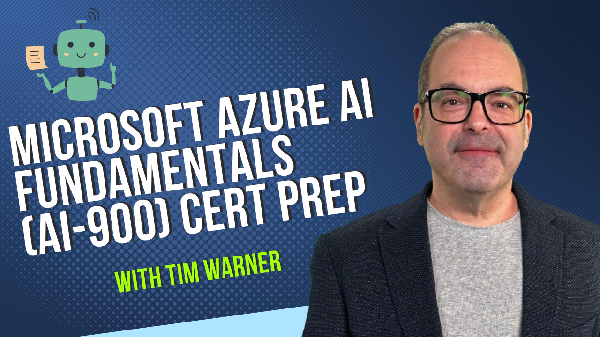

# Microsoft Azure AI Fundamentals (AI-900) Certification Prep



[](https://techtrainertim.com) [](https://github.com/timothywarner) [](https://www.linkedin.com/in/timothywarner)

Short link: [go.techtrainertim.com/ai900](https://github.com/timothywarner/ai900/)

Official preparation course for the **Microsoft Azure AI Fundamentals (AI-900)** certification exam. O'Reilly live training -- 5 hours, 80% demos, 20% theory.

## Exam Information

- **Exam Code**: AI-900
- **Objectives Updated**: May 2, 2025
- **Official Page**: [Microsoft Learn AI-900](https://learn.microsoft.com/credentials/certifications/azure-ai-fundamentals/)
- **Practice Assessment**: [Free official practice questions](https://learn.microsoft.com/credentials/certifications/exams/ai-900/practice/assessment?assessment-type=practice&assessmentId=26)
- **Exam Sandbox**: [aka.ms/examdemo](https://aka.ms/examdemo)

## Exam Domains (May 2025 Update)

| Domain | Weight |
|--------|--------|
| Describe AI workloads and considerations | 15-20% |
| Describe fundamental principles of machine learning on Azure | 15-20% |
| Describe features of computer vision workloads on Azure | 15-20% |
| Describe features of NLP workloads on Azure | 15-20% |
| **Describe features of generative AI workloads on Azure** | **20-25% (HIGHEST)** |

For full objective details, see [AI-900-exam-objectives.md](./docs/AI-900-exam-objectives.md).

## Repository Structure

```text
ai900/
├── demos/                          # Live class demos (Python + uv)
│   ├── assets/                     # Shared media & datasets (LFS-tracked)
│   ├── hour-1-ai-fundamentals/     # Vision, Content Safety, RAI
│   ├── hour-2-machine-learning/    # sklearn classification/regression/clustering
│   ├── hour-3-computer-vision/     # Image Analysis, OCR, Face, Doc Intel
│   ├── hour-4-nlp/                 # Sentiment, NER, Speech, CLU
│   └── hour-5-generative-ai/       # GPT-4o, DALL-E 3, prompt engineering, RAG
├── docs/                           # Course materials & exam prep
│   ├── warner-ai900-nov-2025.pptx  # Slide deck
│   ├── AI-900-exam-objectives.md   # Full objective domain
│   ├── AI-900-CORE-RESOURCES.md    # Curated study materials
│   ├── PRACTICE-QUESTIONS-GUIDE.md # Practice exam resources
│   └── ai900-practice-question-prompt.txt
├── bicep/                          # CAF-aligned IaC for lab environment
├── feb-2026/                       # Current delivery course plan
│   └── to-be-archived/             # Legacy content staged for removal
├── images/                         # README cover image
└── scripts/                        # Utility scripts
```

## Running the Demos

Each demo is a standalone Python project managed with [uv](https://docs.astral.sh/uv/). You need Python 3.11+ and uv installed.

```bash
cd demos/hour-1-ai-fundamentals
uv sync                   # creates .venv and installs dependencies
uv run python main.py     # launches interactive menu
```

Repeat for any `hour-N-*` folder. All demos share a single `demos/.env` file for Azure credentials:

```bash
cp demos/.env.example demos/.env
# Fill in your Azure AI Services keys and endpoints
```

## Bicep Deployment

Deploy the full lab environment with one command:

```bash
az deployment group create \
  --resource-group AI900-Feb2026 \
  --template-file bicep/main.bicep \
  --parameters bicep/parameters/dev.bicepparam
```

## Azure Terminology (Current as of May 2025)

The exam uses current Azure service names exclusively. Deprecated names appear only as **wrong** answers.

| Deprecated Name | Current Name |
|-----------------|--------------|
| Cognitive Services | **Azure AI Services** |
| LUIS | **CLU (Conversational Language Understanding)** |
| QnA Maker | **Custom Question Answering** |
| AI Studio | **Microsoft Foundry** (ai.azure.com) |
| Language Studio | **Deprecated** -- use Microsoft Foundry portal |

## Key Azure Portals

| Portal | URL | Notes |
|--------|-----|-------|
| Azure Portal | portal.azure.com | Resource management |
| Microsoft Foundry | ai.azure.com | Primary for Language, GenAI, model catalog |
| Azure ML Studio | ml.azure.com | AutoML, Designer, endpoints |
| Vision Studio | portal.vision.cognitive.azure.com | Image Analysis, OCR, Face |
| Speech Studio | speech.microsoft.com | Speech-to-text, text-to-speech |
| Custom Vision | customvision.ai | Image classification, object detection |

## Study Resources

### In This Repo

- [Practice Questions Guide](./docs/PRACTICE-QUESTIONS-GUIDE.md) -- 15 practice exam resources and study strategies
- [AI-900 Core Resources](./docs/AI-900-CORE-RESOURCES.md) -- Curated study materials, practice exams, MS Learn paths
- [MCP Microsoft Docs Server Guide](./docs/MCP-DOCS-SERVER-GUIDE.md) -- Use Claude AI + MS Docs for interactive cert prep
- [Docs Index](./docs/INDEX.md) -- Guided tour of all course materials

### Microsoft Learn Paths

- [Get started with AI on Azure](https://learn.microsoft.com/training/paths/get-started-with-artificial-intelligence-on-azure/)
- [Create no-code predictive models with Azure ML](https://learn.microsoft.com/training/paths/create-no-code-predictive-models-azure-machine-learning/)
- [Explore computer vision in Microsoft Azure](https://learn.microsoft.com/training/paths/explore-computer-vision-microsoft-azure/)
- [Explore natural language processing](https://learn.microsoft.com/training/paths/explore-natural-language-processing/)
- [Explore generative AI with Azure](https://learn.microsoft.com/training/paths/introduction-generative-ai/)

### Register for Exam

- [Pearson VUE Exam Registration](https://home.pearsonvue.com/microsoft)
- [Microsoft Certification Deals](https://learn.microsoft.com/credentials/certifications/deals)

## Prerequisites

- Basic understanding of cloud computing concepts
- Microsoft Azure subscription ([free trial](https://azure.microsoft.com/free/) or paid)
- Python 3.11+ and [uv](https://docs.astral.sh/uv/) for running demos
- Interest in artificial intelligence and machine learning

## Instructor Contact

- **Name:** Tim Warner
- **Title:** Microsoft MVP & Certified Trainer
- **Website:** [techtrainertim.com](https://techtrainertim.com)
- **GitHub:** [@timothywarner](https://github.com/timothywarner)
- **LinkedIn:** [Timothy Warner](https://linkedin.com/in/timothywarner)
- **Twitter:** [@TechTrainerTim](https://twitter.com/TechTrainerTim)
- **YouTube:** [Tech Trainer Tim](https://youtube.com/c/TimothyWarner)
- **Email:** [tim@techtrainertim.com](mailto:tim@techtrainertim.com)
- **Microsoft Learn:** [TimothyWarner](https://learn.microsoft.com/users/timothywarner/transcript)

## License

This course material is licensed under the MIT License. See the [LICENSE](LICENSE) file for details.
