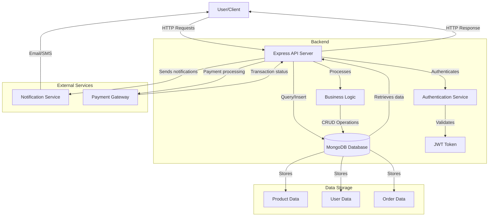

# Application Data Flow Diagram

This diagram illustrates the data flow in the Copilot Enterprise Demo application.

## Key Components

1. **User/Client**: The frontend application or external service that interacts with our API
2. **Express API Server**: Handles HTTP requests and routes them to appropriate handlers
3. **MongoDB Database**: Stores all application data including products, users, and orders
4. **Authentication Service**: Manages user authentication and authorization
5. **Business Logic**: Implements the core application functionality
6. **External Services**: Third-party integrations for notifications and payments

## Data Flow Steps

1. User sends HTTP requests to the API server
2. API authenticates the request using the Authentication Service
3. Once authenticated, the API processes the request through Business Logic
4. Business Logic performs CRUD operations on the MongoDB Database
5. External services are called as needed (notifications, payments)
6. Data is retrieved from the database and returned to the API
7. API sends HTTP response back to the User/Client