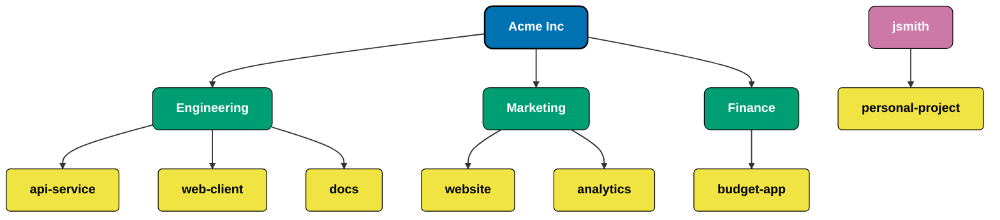

# GitHub Enterprise Cloud Hierarchy

## Understanding the GitHub Enterprise Cloud Hierarchy

The diagram above illustrates the hierarchical structure of GitHub Enterprise Cloud:

1. **Enterprise Level**: The top-level container that represents your GitHub Enterprise Cloud account.
   - Example: `github.com/enterprises/acme`

2. **Organization Level**: Organizations are shared accounts where businesses and open-source projects can collaborate across many projects at once.
   - Example: `github.com/acme-eng`

3. **Individual User Level**: Individual GitHub users who can own repositories directly.
   - Example: `github.com/jsmith`

4. **Repository Level**: Repositories contain all of your project's files and each file's revision history. As shown in the diagram, repositories can be owned by either:
   - Organizations: `github.com/acme-eng/api-service`
   - Individual users: `github.com/jsmith/personal-project`

This hierarchical structure is important for understanding how GitHub Copilot governance works, as policies and settings can be applied at different levels of this hierarchy. For example, Copilot access can be managed at the enterprise level and cascade down, or be configured differently at the organization or repository level.

